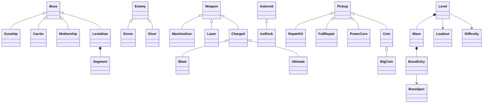

# Dodging Asteroid — Developer Guide

How the game works, where everything comes from, and how to maintain and extend it.
Quick references elsewhere: [CLAUDE.md](../CLAUDE.md) (module map + conventions),
[PROGRESS.md](../PROGRESS.md) (current state, decisions, log), [ROADMAP.md](../ROADMAP.md) (plans).

---

## 1. Get it running (fresh clone or new machine)

```bash
git clone <repo> && cd ESA3
git checkout <branch>                 # main = stable; features live on branches
python3 -m venv .venv                 # Python 3.9–3.13 (pygame has no 3.14 wheels yet)
source .venv/bin/activate
pip install -r requirements.txt       # only runtime dependency: pygame
pip install pyflakes                  # optional: the linter used below
python3 ESA3.py
```

The **first start takes ~10 s longer**: the game synthesizes its music and sound effects into
`sounds/generated/` (git-ignored). After that they load instantly.

| Command | What it does |
|---|---|
| `python3 ESA3.py` | play |
| `python3 ESA3.py --level 4` | start at level 4 |
| `python3 ESA3.py --level 4 --boss` | straight to that level's last boss |
| `python3 ESA3.py --dev` | dev menu: any level / wave / boss, any ship, god mode, hotkeys |
| `python3 tools/build_audio.py [names]` | re-render sounds / music after changing a recipe |
| `SDL_VIDEODRIVER=dummy SDL_AUDIODRIVER=dummy python3 ESA3.py --smoke-test` | headless self-test |
| `python3 -m pyflakes ESA3.py game/ tests/ tools/` | lint |

`save.json` (project root, git-ignored) holds your records, unlocked levels, chosen ship, coin bank
and best rank per level (version 2; a version 1 file loads with an empty bank).
Delete it to start fresh. Tests and `--dev` never write it.

---

## 2. Where do the assets come from?

**There are no image or audio files used by the game.** Everything is generated by Python code
when the game starts: there is no compile step and no asset pipeline.

| Asset | How it's made | When | Where in code |
|---|---|---|---|
| Player ships (4 hulls x 4 paint jobs) | character rows (`"KWLR..."`) -> pixels; banked + leaning frames via RotSprite rotation | startup | `player/hulls.py`, `player/art.py` |
| Bosses | drawn with shapes on a `CharCanvas` (left half), mirrored + outlined; one sprite per phase | startup / when the boss spawns (Leviathan: startup, `prebuild()`) | one file per boss in `bosses/` |
| Minions | character rows; Diver has 16 rotated frames | startup | `minions/drone.py`, `minions/diver.py` |
| Asteroids | procedural: circle distorted by random sine harmonics, sphere lighting, craters, dithering, 24 rotation frames each | startup (a library of ~30 rocks) | `obstacles/art.py` |
| Background | procedural noise nebula per level, shaded planets, 3-layer starfield | startup | `background/` |
| Font | 5x7 glyphs written as strings | startup | `core/pixelfont.py` |
| Explosions, flames, smoke | particles spawned every frame | runtime | `core/particles.py` |
| Music (8 songs + 3 jingles) | notes and chords as text -> pure-Python synthesizer (square / triangle / noise, ADSR, echo) | rendered to WAV **once**, then cached | `audio/music.py`, `audio/synth.py` |
| Sound effects (~28) | recipes: tones, sweeps and noise mixed together | same WAV cache | `audio/sfx.py` |

Everything is drawn on a small **320x240 canvas** and scaled x3 with nearest-neighbour
filtering: that is what makes it look like real retro pixels.

Legacy: `images/`, `astroids/`, `sounds/crash.wav`, `sounds/nes.mp3` are from the first version
of the assignment and are **not loaded** anymore.

> **Cache gotcha:** the game only renders *missing* WAVs. If you change a recipe in `sfx.py`
> or `music.py`, run `python3 tools/build_audio.py <name>`, or the old sound keeps playing.

---

## 3. Is the behaviour fixed or random?

A mix. The **rules are fixed** (same patterns, same balance every run), the **details are
randomised**, and most enemies **react to where you are**. Nothing learns from you yet (that
is the planned NEMESIS mode, ROADMAP Phase 9).

| Thing | Fixed | Random | Reacts to the player |
|---|---|---|---|
| Asteroids | size range, speeds per level | shape of every rock (new each start), spawn x, speed, drift, spin, colour, split directions | pushed back by your shots |
| Drones | the 3 formation shapes | which formation, where, sway phase, shot timing | steer towards your x, aim at you |
| Divers | lock time, dive speed | squad size (2–4), positions, hover height | aim line follows you, dive at your spot |
| Gunship / Carrier / Mothership | attack order per phase (a fixed cycle), movement path | ring offsets, Carrier rain, gap position in bullet walls | aimed fans, walls leave a gap near you, beam follows you |
| Leviathan | attack cycle per phase | where it swims (random waypoints), which plate sheds bullets | ripple shots aimed at you, dives lock onto your position |
| Pickups | kit every 13–20 s | timing, position, drop chances, full vs small kit | kits and power cores drift to you |
| Coins | boss coins (30 + 10 x level, half for a rematch), clear bonus, rank rules | which rock / minion drops coins, how many | coins drift to you; boss coins home in |

So two runs never look the same, but a boss always "plays by the same rules". That is
intentional: it lets players learn the patterns.

---

## 4. How the game works (who does what)

### The Game object and its mixins

`ESA3.py` only parses arguments and creates `Game` (`game/flow/game.py`). `Game` owns
everything (window, ship, weapons, rocks, enemies, boss, particles, audio, save) and runs the
loop. Its behaviour is split into **mixins**, one file each, all working on the same `self`:

| Mixin | File | Responsibility |
|---|---|---|
| `EventsMixin` | `flow/events.py` | keyboard + mouse events, one `_keys_<state>` method per state |
| `LevelFlowMixin` | `flow/level_flow.py` | start / retry a level, field -> warning -> boss -> cleared, waves, level clear |
| `WorldMixin` | `flow/world.py` | move rocks, enemies, bullets, pickups; hazards that hurt the ship |
| `CombatMixin` | `flow/combat.py` | the player's hits: damage, kills, splitting, score, BLAST / ULT charge |
| `ProgressionMixin` | `flow/progression.py` | pending coins, `LevelStats`, rank + payout into the bank when a level is won |
| `HangarMixin` | `flow/hangar.py` | hangar tabs (ships, weapons, wingmen, upgrades, skins), buying with a confirm step, weapon slots, launching, gift screen |
| `JuiceMixin` | `flow/juice.py` | juice tiers (`juice(tier, x, y)`: shake, hit-stop, embers, flash, slow-mo), `world_dt()`, boss damage numbers, radio cards |
| `BoostsMixin` | `flow/boosts.py` | boost timers and drops, the shield, `enemy_dt()` (SLOW-MO), combo / FEVER |
| `WingmenMixin` | `flow/wingmen.py` | the flying wingmen, their hits and knock-outs, XP (banked at level end) |
| `SkinsMixin` | `flow/skins.py` | skins worn (trail, tracers, beam, paint, death style), achievements |
| `OptionsMixin` | `flow/options.py` | pause-menu options (volume, reduce shake / flashes), saved |
| `SoundMixin` | `flow/sound.py` | which music plays in which state, engine / laser loops |
| `DevMixin` | `flow/dev.py` | dev menu items, god mode, hotkeys |
| `FinaleMixin` | `flow/finale.py` | the galaxy finale: WARP cut-scene, medal, then the win results |
| `BrainsMixin` | `flow/brains.py` | the enemy's brains: player model per frame, DIRECTOR pressure, bandits per boss, saved |
| `JournalMixin` | `flow/journal.py` | the JOURNAL (J): builds a `JournalPage` (pilot, boss files, echoes, radio log) for `ui/journal.py` |
| `StarMapMixin` | `flow/starmap.py` | the STAR MAP: fly between planets, data caches (coins once, EXPLORER), landing opens the hangar |
| `ScreensMixin` | `ui/screens.py` | drawing every frame and every state's overlay |

### One frame

```
run():  handle_events()          keys/mouse -> self.held, self.mouse, state handlers
        update(dt, held, mouse)  ship -> background -> rocks -> boss -> enemies -> weapons
                                 -> enemy bullets -> pickups -> collisions -> level phase
        draw()                   background, rocks, boss, enemies, ship, shots, particles, HUD
        _present()               scale the 320x240 canvas x3 into the window (+ scanlines)
```

`dt` is in seconds and every speed is px/second, so the game runs the same at any frame rate.

### States and phases

- **State** (`flow/states.py`): TITLE (J: JOURNAL) -> STAR_MAP -> HANGAR -> PLAYING -> (PAUSED / DYING ->
  GAME_OVER) -> LEVEL_CLEAR (results) -> REWARD (gift, first clear only) -> HANGAR -> PLAYING
  ... -> (WARP after a `finale` level) -> WIN -> gift -> STAR_MAP. Plus DEV_MENU. ESC goes one
  screen back (hangar -> map -> title).
- **Phase** while PLAYING: FIELD (asteroids, progress bar) -> WARNING (hull repaired) ->
  BOSS -> CLEARED, repeated for every boss of a wave and every wave of a level.

### Important object families (the OOP part)



Key ideas:
- **Weapons never apply damage.** `weapon.update()` returns `Hit` records; `CombatMixin`
  applies them. Anything with `x`, `y`, `bound`, `contains()` can be shot.
- **Levels are data** (`levels/data.py`): a `Level` has a `Loadout` (ship model), a
  `Difficulty` (spawn rates, rock colours, minions) and `Wave`s, each ending in `BossEntry`s.
- **Boss balance is computed, never hand-picked.** `BossSpec(name, strength, fight_time,
  player=<Loadout>)` derives HP and damage so the boss is `strength` times stronger than your
  ship in a damage race. Pickups and power-ups are your edge.
- **Hulls** multiply the level's ship model and keep `hp * firepower == 1`, so every ship is
  equally strong against bosses.

---

## 5. Workflow

1. **Branch:** `git checkout -b my-feature` (`main` stays stable).
2. **Before changing anything:** run the smoke test once. It should say `smoke test OK`.
3. **Make the change** following the recipes below.
4. **Test after every change:**
   ```bash
   SDL_VIDEODRIVER=dummy SDL_AUDIODRIVER=dummy python3 ESA3.py --smoke-test
   SDL_VIDEODRIVER=dummy SDL_AUDIODRIVER=dummy python3 ESA3.py --smoke-test --only level4,busy
   SDL_VIDEODRIVER=dummy SDL_AUDIODRIVER=dummy python3 ESA3.py --smoke-test --shots /tmp/shots
   python3 -m pyflakes ESA3.py game/ tests/ tools/
   ```
   `--shots` saves a screenshot of every tested moment: the quickest way to eyeball changes.
5. **Play it:** `python3 ESA3.py --dev` jumps anywhere. In game: **N** skips (field / warning /
   boss phase), **1** fills BLAST + ULT, **2** power-up, **3** repair, **G** god mode.
6. **Check a real window** for visual changes: the headless driver hides a macOS problem
   (sprites turning into black boxes). The script is in CLAUDE.md, "Verify in a real window".
7. **Update [PROGRESS.md](../PROGRESS.md)** (snapshot + log), then commit and merge to `main`.

---

## 6. Recipes: adding things

Rule of thumb: **numbers go in `config/tuning.py`**, art sits **next to the class that uses it**,
colours shared by several things go in `config/palette.py`.

### A new level

1. Add a nebula colour set to `config/palette.py` (`NEBULA_X = [dark, mid, light]`).
2. Optional new ship model: a `Loadout` in `config/loadouts.py` + its paint job in
   `player/art.SHIP_PALETTES` (copy `"mk4"` and change colours).
3. Optional level song: a function in `audio/music.py` (copy `level4()`), add it to `SONGS`,
   run `python3 tools/build_audio.py <name>`.
4. Append a `Level(...)` to `LEVELS` in `levels/data.py`:
   ```python
   Level(5, "SOLAR STORM", MK4,
         Difficulty(spawn_interval=0.45, speed_min=70, speed_max=130, radius_min=4,
                    radius_max=14, drift=24, palettes=("rust", "grey"),
                    formation_interval=10, diver_interval=8),
         tuple(NEBULA_X),
         (Wave(45, name="FIRST WAVE"),
          Wave(40, (BossEntry(Leviathan, BossSpec("LEVIATHAN", strength=1.5, fight_time=35,
                                                  player=MK4)),), name="REMATCH")),
         music="level5", upgrade_notes=("SOMETHING NEW",))
   ```
   Every `BossSpec` must use `player=` the level's loadout (the smoke test checks this).
5. Optional per level: `radio=(...)` lines (<= 43 characters, the smoke test checks),
   `event=` a background event layer class, `hazard=` a level-wide mechanic class, and in
   `Difficulty`: `extras=((spawn_function, seconds), ...)` minion spawners, `rock_hp`,
   `enemy_hp` (later ship models hit much harder, so later fields need tougher rocks).
   Per wave: `music=` its own field track, `escape=True` for a timed run without a boss
   (the level's hazard reads `game.wave.escape`, e.g. the hive collapses). `finale=True` on
   a galaxy's last level plays the WARP cut-scene and awards the galaxy medal.
6. The gift after its first clear: `GIFTS["1-n"] = (item_a, item_b)` in `progression/items.py`.
7. Automatic: level select, unlocking, dev menu entries, level-clear screen, WIN after the last level.
8. The star map: add a planet position to `starmap/model.NODES` (one per level, in order).
9. Tests: the `level10` section expects WARP + WIN after level 10 (the last level). A level
   11 moves those checks into a new section in `tests/smoke.py` (add it to `SECTIONS`).

### A new boss

1. Create `bosses/<name>.py`. Copy the structure of `mothership.py`:
   - the sprite: `_x_half()` draws the left half on a `CharCanvas` (`poly`, `line`, `rect`,
     `circle`, `set` with colour letters), `build_boss_sprite(half, colors)` mirrors and
     outlines it; one image per phase (recolour the lights, crack it in the last phase);
   - muzzle / vent coordinates (pixel positions in the final sprite);
   - `class X(Boss)` with `PHASES`, `PATTERNS` (a list of `(attack_name, seconds)` per phase),
     `fight(dt, world)` that cycles the patterns and calls `_<attack>(world)` methods;
   - `self.bullet_damage = spec.dps / AIMED_RATE`, where `AIMED_RATE` = aimed bullets per
     second hitting a rocket that never moves (see the formula in `mothership.py`). This keeps
     the `strength` promise.
2. Optional hooks: `on_phase()` (reset timers on a phase change), `draw()` (extra effects),
   `prebuild()` (expensive sprites at startup), `parts()` + `hit_part()` (boss made of pieces,
   see `leviathan.py`), `contact_damage`.
3. Bullets: `self._shoot(world, x, y, angle, speed, damage)` (with muzzle flash + sound) or
   `world.enemy_bullets.append(bullet(...))` for big patterns.
4. Put it in a level: `BossEntry(X, BossSpec("NAME", strength=4, fight_time=60, player=MKn),
   music="boss")`.
5. Add it to the docstring in `bosses/__init__.py`, and add a smoke-test check for its special
   attack.

### A new minion

1. `minions/<name>.py`: sprite rows + colours, `class X(Enemy)` with `points`,
   `contact_damage`, `move(dt, world)` and `attack(dt, world)`. Add `prebuild()` if it rotates.
2. A formation function returning a list of instances (like `drone_formation()`).
3. Spawn it as data: `Difficulty(extras=((x_squad, 9),))` — a function `x_squad(game)` that
   returns a list of new enemies, and the seconds between squads. The level's `enemy_hp`
   scales them (`LevelFlowMixin.spawn_enemies`).
4. Shooting it, charging BLAST / ULT, scoring and ramming damage all work automatically.
   Hooks: `armour(hit)` (a damage multiplier, e.g. a shield that faces one way),
   `on_death(world, scored)` (e.g. a mine's blast), `drops_coins`, `stat` (False = doesn't
   count for or against the "destroyed" rating), `contact_damage` can be a property.

### A new obstacle type

1. Palette in `config/palette.ROCK_PALETTES` (`[outline, darkest ... lightest]`).
2. Subclass `Asteroid` in `obstacles/asteroid.py`: change `SPLIT_RADIUS`, `HP_FACTOR`,
   `SPARKLE`, `fragments()`, `break_sound()` (see `IceRock`), or the flags the game reacts
   to: `EXPLODES` (magma: `area_blast`), `REFRACTS` (crystal: splits the laser), `METAL`
   (wreck: clang, coins), `FRAGMENT` (class of its pieces).
3. Register it: `ROCK_KINDS = {"ice": IceRock, "metal": MetalRock}`.
4. Use the palette name in a level's `Difficulty(palettes=(...))`. The five classic palettes
   are prebuilt at startup; later palettes get big "signature" rocks built in the background
   while the menus run (`AsteroidLibrary.queue` / `build_step`), and `pick()` falls back to
   the nearest prebuilt size, so nothing is rendered mid-game.

### A level hazard or a background event layer

- **Event layer** (looks only): a class in `background/events.py` with `update(dt,
  world_speed)` and `draw(surf)`; keep it dark (<= 40% brightness). Set `Level(event=X)`.
- **Hazard** (gameplay, like the fog banks or the black hole): a `Hazard` subclass in
  `hazards/<name>.py` with `update(dt, game)` (it can move anything in the world) and
  `draw_back` (behind rocks), `draw_mid` (over rocks and minions, under the ship and enemy
  bullets) and `draw_front`. Set `Level(hazard=X)`; the game creates one per attempt as
  `game.hazard`.

### Story: a dialog, a boss file, a puzzle piece

- **A conversation:** `radio_say([...])` takes plain strings (Vega) and `story.dialog.Line(speaker,
  text)`; a change of speaker starts a new card, VANTA / `???` cards glitch (hijack). One-off
  story beats go into `story/lore.TRANSMISSIONS` and are remembered in `save.story`.
- **A boss file:** a `Dossier(boss_spec_name, facts, vanta, note)` in `story/lore.DOSSIERS`. The
  journal shows it once the boss is beaten (`save.bosses`, or a cleared level with that boss).
- **A puzzle piece:** read the answer in the `story/lore.py` docstring first. A clue must agree
  with it (a player who reads everything must find no contradiction). Kinds so far: ECHOES
  (mosaic tiles in caches), margin notes, the radio ACROSTIC, the ghost record, dossier lines.

### A boss that learns (galaxy 2)

`class MyBoss(Learner, Boss)` (`bosses/learning.py`). When a pattern slot starts, ask
`name = self.begin_attack(world, options)` instead of cycling `PATTERNS`; call
`self.learn_tick(dt)` every fight frame. The game credits it with the damage it deals, and
the bandit (saved per boss name) favours what hurts this player. Aim with
`self.lead_aim(world, x, y, speed)`; check `self.counters(world)` ("floor", "left",
"right", "mirror") to add a punishing pattern. Call `world.telegraph()` when an attack is
shown, so the model learns the player's reaction time. Balance stays `BossSpec`.

### A star map secret (data cache)

Append a `Cache(id, x, y, title, lines, coins)` to `starmap/model.CACHES` (map px inside
`MAP_W x MAP_H`, lines <= 40 characters — the smoke test checks). It is invisible until the
rocket is `MAP_CACHE_SEEN` px away; the scanner ring beeps faster as it gets close. Finding
every cache earns EXPLORER, so a new cache makes that achievement a little harder.

### A new player ship (hull)

`player/hulls.py`: draw its rows, then `Hull("NAME", "BLURB", rows, nozzles=..., barrels=...,
hp=..., firepower=...)`, keeping `hp * firepower == 1`. Add it to `HULLS`, and add an
`Item(id=<hull name>, kind=SHIP, ...)` with blurb and price to `progression/items.py` (plus a
`GIFTS` entry for the level that gives it); it then shows up in the hangar. Nozzles = x-offsets of the engines, barrels = gun positions relative to the centre.

### A new item (inventory, gift, shop)

`progression/items.py` is the catalog: an `Item` (id = the name the game uses, kind = tab,
two blurb lines of at most 21 characters, shop price), `STARTER` (owned by a new player) and
`GIFTS` (level key -> 1 or 2 item ids). `Inventory` (`progression/inventory.py`) answers
`owns()` / `status()` and handles `claim()` and `buy()`. The game gates on it in one place per
thing: `LevelFlowMixin.loadout_for()` (BLAST + ULT), `switch_weapon()` (laser), `choose_hull()`
calls from the hangar. A weapon icon goes in `ui/item_art.ICON_ROWS`.

### A new upgrade track

Upgrades are tiers bought in the hangar's UPGRADES tab, applied on top of the level's ship
model **after** the hull (`LevelFlowMixin.loadout_for()`). Bosses keep using the par model
(`Level.loadout` in their `BossSpec`), so upgrades are always an edge, never a rebalance.
1. `config/tuning.py`: the track's per-tier bonus in `UPGRADE_BONUS` (prices are shared:
   `UPGRADE_COSTS`).
2. `progression/upgrades.py`: a `Track(id, stat, blurb)` in `TRACKS`, and its effect in
   `apply()` (a new stat needs a `Loadout` field with a neutral default, like `charge_rate`,
   and the code that reads it). If it wins boss fights (HP or damage), include it in
   `power_ratio()` — the smoke test checks that a maxed build still faces a 5x boss as >= 3.5x.
3. `ui/item_art.UPGRADE_ICON_ROWS`: an 11x13 icon; `HangarScreen._track_value()`: how its
   stat reads in the details line.
Tiers are saved in `SaveData.upgrades` ({track: tier}); unknown tracks are ignored.

### A new sound or song

- Sound: a function in `audio/sfx.py` returning samples (mix `tone(...)`, `noise(...)`,
  `seq(...)`, `at(...)`), add it to `SOUNDS`, run `tools/build_audio.py <name>`, then call
  `self.audio.play("<name>")` where the event happens. Volume / rate limit: `VOLUME` and
  `MIN_GAP` in `audio/player.py`. A typo in a name fails the smoke test.
- Song: a function in `audio/music.py` using `song(bpm, chords, melody, ...)`. The melody is
  8 notes per bar (`.` holds, `-` rests), one chord per bar. Add it to `SONGS` (one-shot
  jingles also go in `JINGLES`). Point `Level.music` / `BossEntry.music` at it.

### A new game mode (e.g. endless or NEMESIS)

1. New `State`s in `flow/states.py` (e.g. `ARENA`).
2. Every state **must** have a key handler `_keys_<state>(self, key)` in `flow/events.py`
   (the event loop looks it up by name).
3. The mode's logic goes in a **new mixin** `flow/<mode>.py`, added to the `Game` class bases.
   Create its attributes in `Game.__init__` / `new_run()`.
4. Drawing: a branch in `ScreensMixin._draw_overlay()` (`ui/screens.py`). Music: a branch in
   `SoundMixin._music_track()`.
5. Something to save (e.g. a leaderboard)? Add a field to `SaveData` in `core/storage.py`, in
   both `load()` and `save()` (a missing key must fall back to a default).
6. A menu entry on the title screen (`_keys_title` + `_draw_title`).
7. A smoke-test section that plays the mode for a while.

### Tuning / balance

| What | Where |
|---|---|
| ship speed, weapon damage, heat, rock hp, drone / diver stats, points, timings | `config/tuning.py` |
| ship models (HP / gun / laser per level) | `config/loadouts.py` |
| boss strength and fight length | the `BossSpec` in `levels/data.py` |
| boss attack speeds and pattern order | constants at the top of the boss class |
| rock density, speeds, colours, minion rates per level | `Difficulty` in `levels/data.py` |
| mouse steering feel | `MOUSE_FOLLOW`, `MOUSE_LEAN`, `MOUSE_DEADZONE` in `config/tuning.py` |
| upgrade prices and per-tier bonuses | `UPGRADE_COSTS`, `UPGRADE_BONUS` in `config/tuning.py` |

---

## 7. Troubleshooting

| Symptom | Look at |
|---|---|
| A key does the wrong thing | `flow/events.py`, the `_keys_<state>` handler |
| Mouse feels off | `Ship._follow` / `_stick` in `player/ship.py`, the `MOUSE_*` numbers |
| Sprites are black boxes (macOS only) | a surface made with bare `pygame.Surface()`: use `pixelart.opaque_surface()` for opaque ones, `SRCALPHA` for sprites |
| Changed a sound but hear the old one | the WAV cache: `python3 tools/build_audio.py <name>` |
| No sound at all | audio device missing: the game runs silently by design |
| Wrong music | `flow/sound.py` `_music_track()` or the level's / boss's `music=` |
| Boss too hard / too easy | its `BossSpec` in `levels/data.py`, not the bullet damage |
| Damage / score wrong | `flow/combat.py` (your hits) or `flow/world.py` (hits on you) |
| Game stutters when something appears | expensive sprites built at spawn: move them to `prebuild()` |
| Smoke test fails at random | run with seeds: `python3 -c "from tests.smoke import run_smoke_test; run_smoke_test(seed=3)"` |
| `pygame` won't install | Python 3.14 is too new: use 3.9–3.13 |
